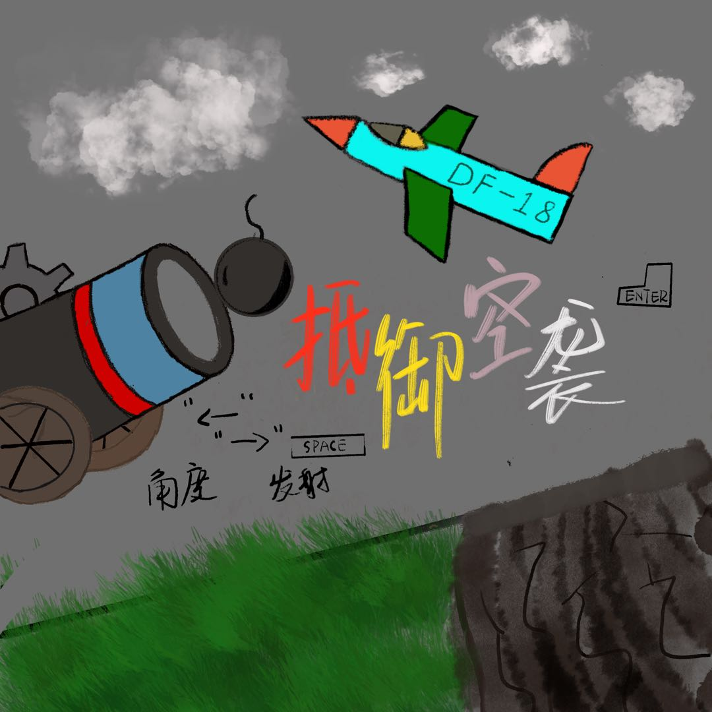

# Resist air strick

## Description

基于acllib库使用VS开发的简易小游戏


### logo

<!--  -->

### introduction 
使用左右键控制炮台方向，空格键射击

### language 

- C

### technology stack  
- acllib.h

- Visual Stutdio

### current

## Vision
 
## Construction

## Build
- 运行ResistAirStrikes.exe

- 手动编译代码
```bash
make .
.\ResistAirStrikes.exe
```

## Contributors  
- [aaaris](https://github.com/aaaris)

## Thanks 
本游戏所使用的库来自[wengkai的项目](https://github.com/wengkai/ACLLib)

本游戏设计思路来自[中国大学MOOC-C语言程序设计进阶](https://www.icourse163.org/course/ZJU-200001?tid=1464397446)